# ZZZ PrtSc - Gamer's Screenshot Tool

## Hey Proxies!

As a big fan of Zenless Zone Zero, I struggled finding a good screenshot tool for my multi-monitor Windows 11 setup. Most tools were too complicated or didn't support controller shortcuts.

So I decided to make my own! Yep, I know nothing about coding - this was 100% built with AI help. If you're also a gamer, hope this tool helps you capture those epic moments!

---

## Why I Built This

- 🎮 Pressing PrintScreen on multi-monitor setup captures ALL screens - so annoying!
- 📸 Regular screenshot tools are too slow for fast-paced gaming action
- 🎯 Wanted burst capture mode to catch those perfect combat moments
- 🔌 PS5 DualSense Create button was going to waste!

---

## Features

- **One-Click Screenshot**: Press PrintScreen key for instant screenshot
- **Controller Support**: Works with PS5/Xbox/Switch controllers!
  - PS5 DualSense: Press Create button
  - Xbox: Press Share button
  - Switch Pro: Press Capture button
- **Burst Mode**: Capture multiple frames in succession, never miss a moment
- **Quiet Operation**: Minimizes to system tray, won't interrupt your game
- **Smart Detection**: Automatically detects controllers on startup

---

## How to Use

### Download & Install
1. Go to the [Releases](https://github.com/Lupin924/ZZZ-PrtSc/releases) page
2. Download the latest version and run `ZZZ_PrtSc.exe` - no installation needed!

### Basic Operation
1. Launch the program - you'll see a small icon in the system tray
2. Press PrintScreen or your controller's screenshot button
3. Screenshots are saved automatically (you can change the folder in settings)

### Burst Mode
1. Right-click the tray icon and select "Burst Mode"
2. Set duration (1-10 seconds) and frames per second (1-10)
3. Press the screenshot button to start - it will auto-save all frames

### Controller Connection
- Auto-detects controllers on startup (max 2 second wait)
- Click the controller icon in the main window to re-scan

---

## Screenshots

### Application Interface

Simple and clean main interface:

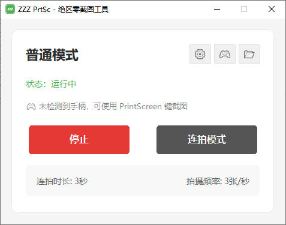

Burst mode settings window:

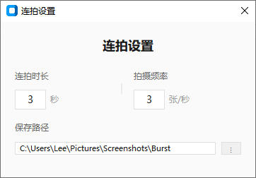

### In-Game Examples

Here are some actual in-game screenshots captured with ZZZ PrtSc:

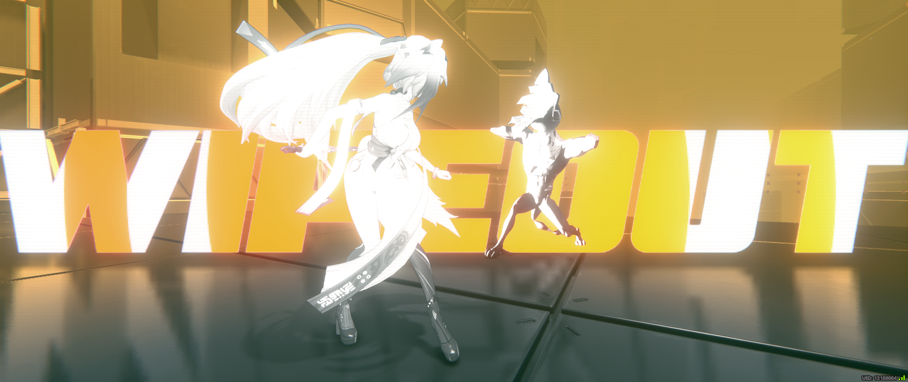

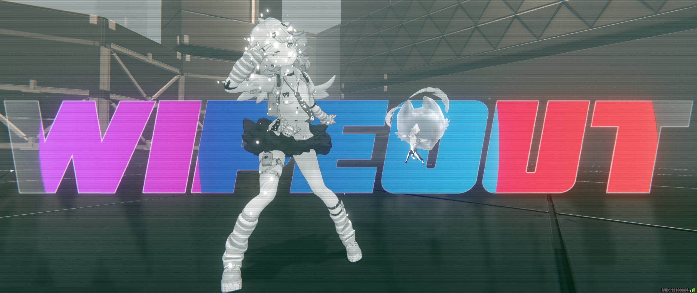

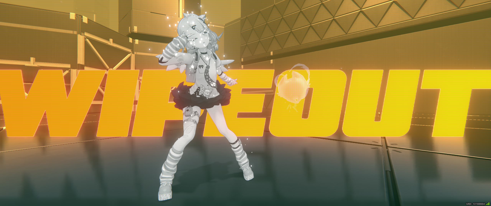

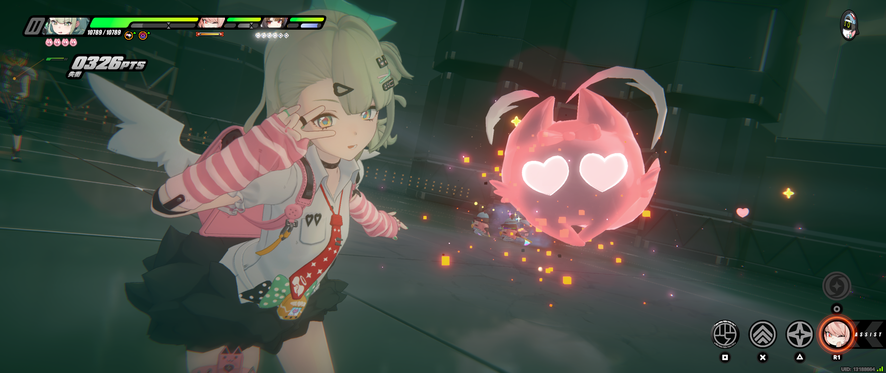

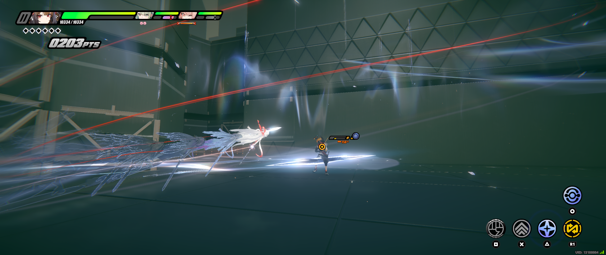

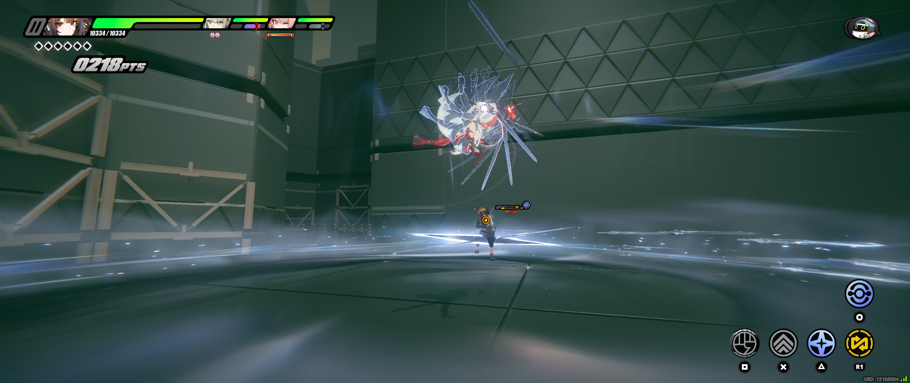

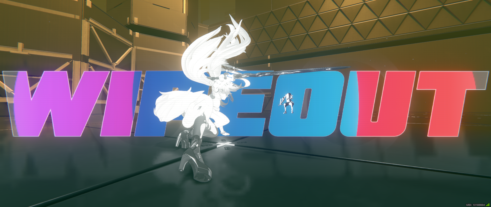

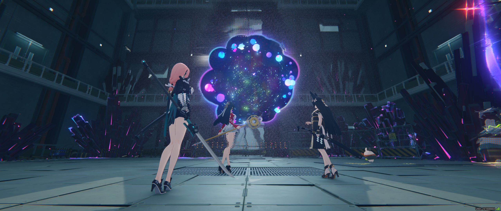

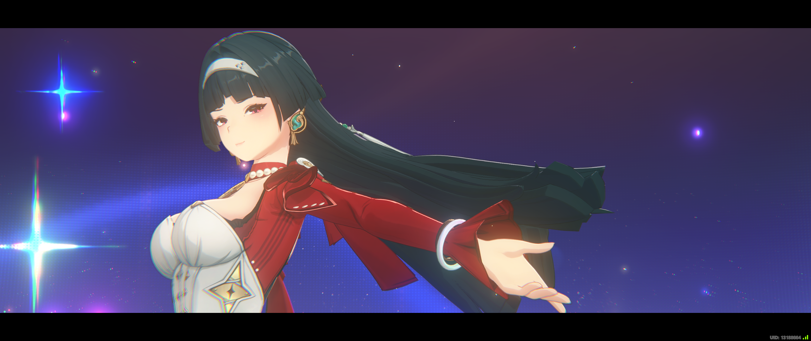

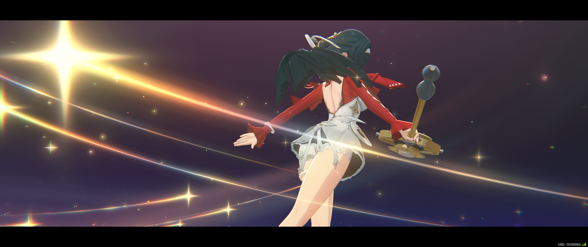

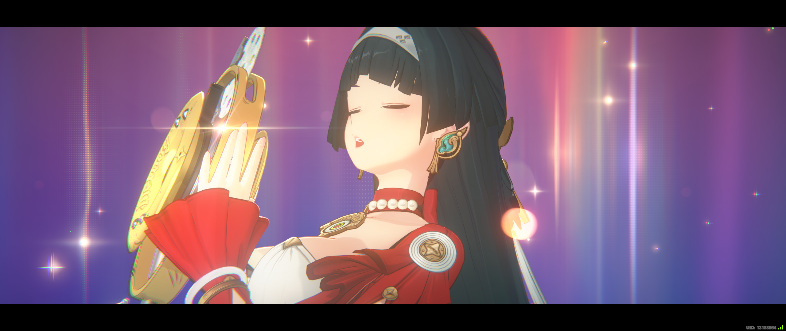

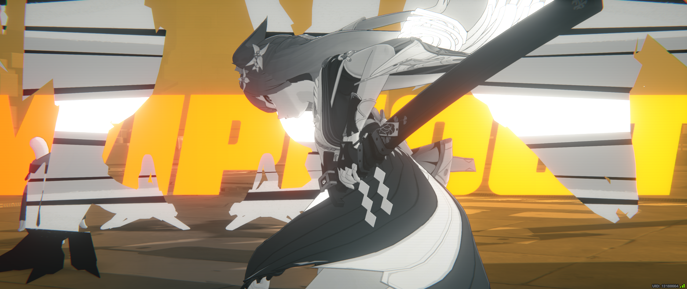

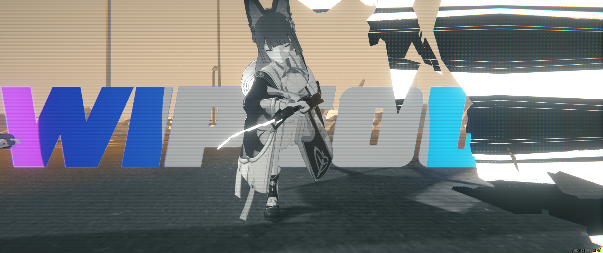

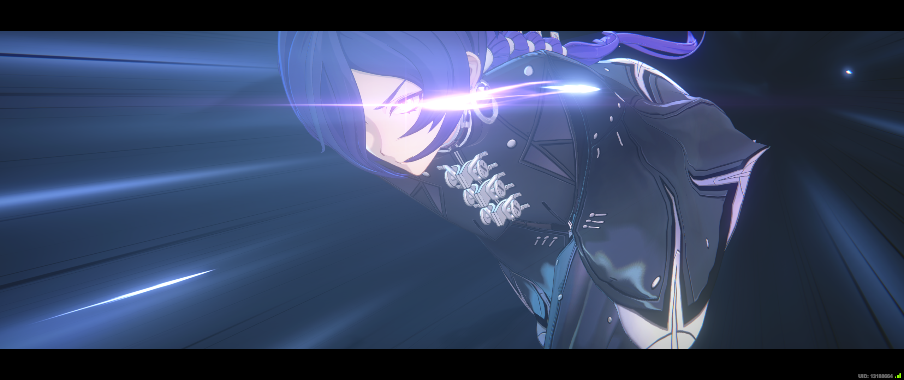

---

## Notes

- Only tested on Windows 10/11
- Only tested with PS5 DualSense so far, Xbox/Switch Pro should work
- Settings saved to `%APPDATA%\ZZZ PrtSc\settings.json`

---

## Disclaimer

⚠️ **Code quality not guaranteed** - I don't know how to code!
⚠️ **May not fix bugs** - but feel free to suggest improvements!

---

**May every Proxy capture all the amazing moments of their Agents!** 📸✨